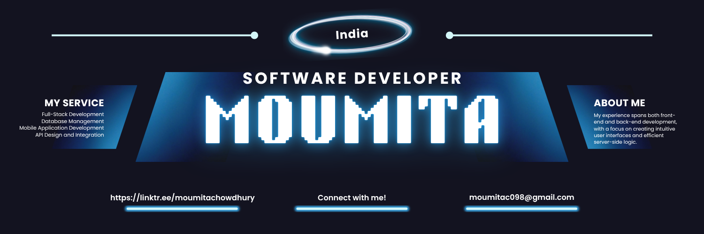

<!-- Banner Image -->

  

<h1 align="center">Hey There, I'm Moumita Chowdhury! 👋</h1>

  <b>B.Tech CSE Student | Aspiring Software Developer | AI & Data Enthusiast</b> 
  <i>Learning. Building. Growing. Ready to make an impact in tech!</i>

  

<!-- ---

 ## 🎯 Career Objective

> Passionate and detail-oriented B.Tech CSE student skilled in Python, Java, and C. I love building robust software solutions, exploring Artificial Intelligence, and diving into Data Analysis. A proactive learner with a knack for problem-solving, I thrive in collaborative environments and am eager to gain industry experience, learn from experts, and make a real-world impact. 

---

## 🏫 Education

**Bachelor of Technology in Computer Science and Engineering**  
Amity University Kolkata (2022 – Present)  
**CGPA:** 9.27

--- -->

## 🛠️ Tech Stack & Skills

   <b>Python</b> &nbsp;
   <b>Java</b> &nbsp;
   <b>C</b> &nbsp;
   <b>SQL/MySQL</b> &nbsp;
   <b>HTML</b> &nbsp;
   <b>CSS</b> &nbsp;
   <b>JavaScript</b> &nbsp;
   <b>PHP</b>

   <b>Flutter</b> &nbsp;
   <b>OpenCV</b> &nbsp;
   <b>Flask</b> &nbsp;
   <b>Apache</b> &nbsp;
   <b>Firebase</b> &nbsp;
   <b>Git</b> &nbsp;
   <b>GitHub</b> &nbsp;
 <b>Supabase</b>

 <!-- <b>Soft Skills:</b> Adaptability, Flexibility, Communication, Leadership, Problem Solving -->

## 🛠️ My Technical Toolbox

<!-- Programming Languages -->
<strong>👩‍💻 Programming Languages</strong> 

<!-- Web Development -->
<strong>🌐 Web Development</strong> 

<!-- Frameworks & Libraries -->
<strong>📱 Frameworks & Libraries</strong> 

<!-- Databases & Backend -->
<strong>🗄️ Databases & Backend</strong> 

<!-- Tools & Platforms -->
<strong>🛠️ Tools & Platforms</strong> 

✨ Always learning, building, and experimenting with new tech!  
Curious about my projects? Scroll down to see what I've been working on! 🚀

<!-- --- -->

## 👩‍💻 Experience

**Full Stack Development Intern**  
_Whiteboard Consultants_ (June 2025 – Aug 2025)
- Engineered a scalable, cross-platform mobile application (LMS) with Flutter and Supabase.
- Designed PostgreSQL database schemas, PL/pgSQL functions for powerful search and data integrity.
- Developed reusable Flutter widgets, intuitive UI/UX, and integrated RESTful APIs for real-time data.
- Managed course, user, and enrollment data with efficient queries and clear constraints.

<!-- --- -->

## 🚀 Projects

  <b>NextHire | Online Job Portal Web Application (2025)</b>
  

<ul>
  <li>Full-stack Java web application for job seekers and employers.</li>
  <li>Built with JSP, JavaScript, Bootstrap frontend; Java Servlets, MySQL backend.</li>
  <li>Features: Secure role-based login, resume uploads, MVC architecture, comprehensive documentation.</li>
</ul>

  <b>RecogX | Automated Attendance System using Facial Recognition (2024)</b>

<ul>
  <li>ML-powered system using OpenCV for real-time facial recognition and attendance.</li>
  <li>Easy-to-use UI; generated detailed attendance reports for admins and users.</li>
</ul>

<!-- --- -->

## 📜 Certifications

- Machine Learning for Engineering and Science Applications — IIT Madras (NPTEL)
- Introduction to Large Language Models (LLMs) — IIT Delhi, IIT Bombay (NPTEL)
- Postman API Fundamentals Student Expert — Postman
- Introduction to Data Science — Coursera

<!-- --- -->

## 🌈 Personal Interests

- 📚 Reading & Journaling
- 🎵 Listening to music (<b>Taylor Swift</b> fan!)
- ☕ Cafe hopping & taking aesthetic photos
- 🗺️ Giving reviews on Google Maps

<!-- --- -->

## 📈 GitHub Stats & Badges

  
  

  

  

<!-- --- -->

## 🌐 Connect with Me

  
  
  

---

  <b>Let's connect, collaborate, and build something amazing! 🚀</b>

